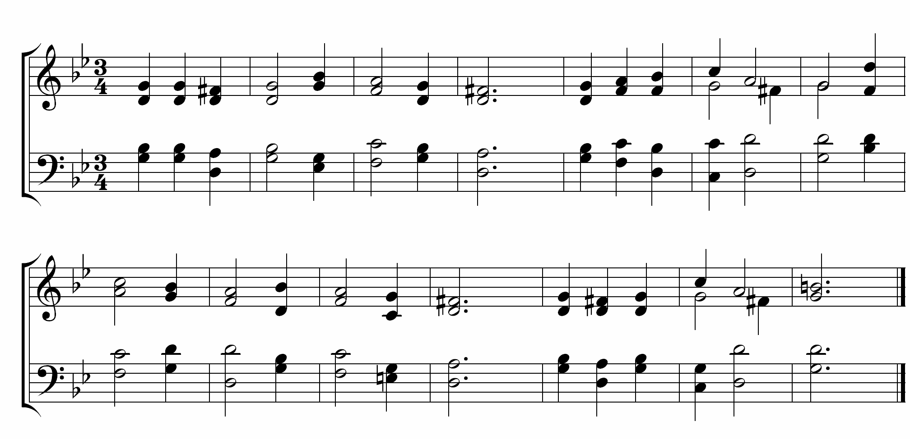

Pianos and other musical instruments may not be physically related to computer science, however, the thought process is. I have learned that when learning a new song on the piano, it requires a considerable amount of time and patience. There will always be times where I fail and constantly press the wrong key or forget how to play the next day, but eventually with more practice I will succeed.

