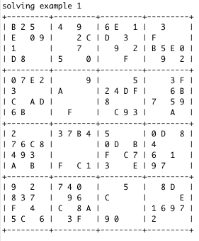
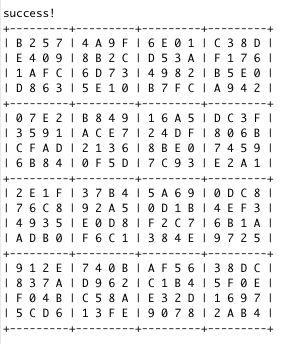
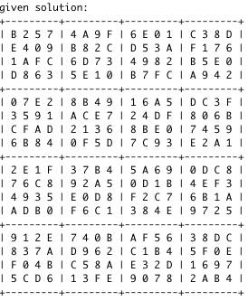
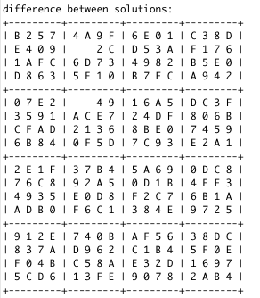

<div class="ui small rounded images">
  
  
  
  
</div>

A Hexadecimal Sudoku is a type of Sudoku that consists of a 16 x 16 grid of integers, meaning that 16 rows, 16 columns, and 16 4 x 4 boxes in the grid. A Sudoku problem has a grid of numbers and empty boxes that are to be filled later. However, each row, column, and 4 x 4 grid cannot have any repeating numbers, otherwise, the sudoku will fail. 

For this project, I had to implement the recursive methoud to find a solution to the given hexadecimal sudoku problems that my Professor, Cam Moore provided with java code. I had to recursively check if all cells were filled and see if the Sudoku was vaild. If it was, we have a solution, otherwise the program fails. 

The codes below represent how I checked to see if the values being inputted were valid integers:

```js
public static ArrayList<Integer> legalValues(int[][] sudoku, int row, int column) {

    if (sudoku[row][column] != -1) {
      return null;
    }
    ArrayList<Integer> legalVal = new ArrayList<Integer>(16);
    for (int i = 0; i < 16; i++) {
      if (isValid(sudoku, row, column, i)) {
        legalVal.add(i);
      }
    }
    return legalVal;
  }
}
```

You can learn more about this assignment on the [ICS 211 Spring 2018 Website](http://courses.ics.hawaii.edu/ics211s18-1/morea/110.recursion/experience-H08.html).


